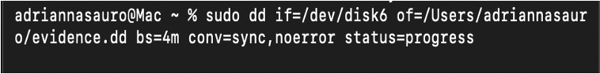
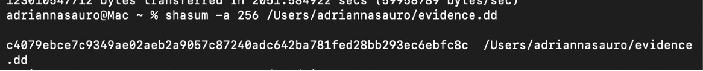
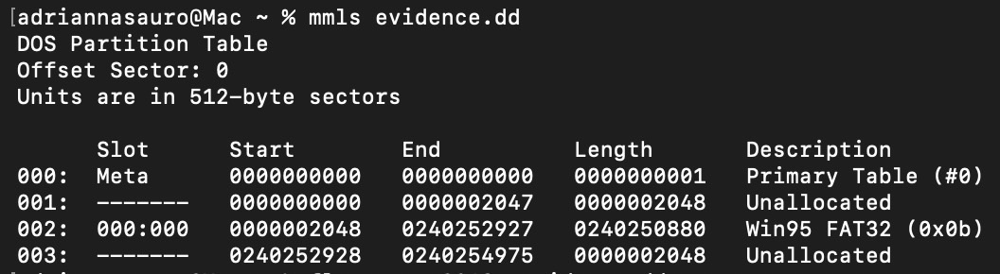
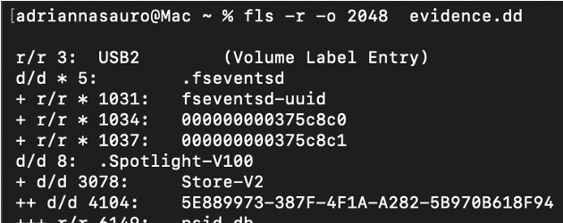

# Disk Forensics – Implementation & Workflow

This document outlines the full disk‑forensics workflow performed on the USB device submitted as evidence in the deepfake identity‑abuse case study. The goal of this phase was to acquire a forensically sound image, verify its integrity, analyze the file system, and recover any deleted artifacts relevant to deepfake creation.

---

## 1. Evidence Identification

The USB device was connected to the analysis workstation and identified using:

- `diskutil list` (macOS)
- Verification of device path (`/dev/disk6`)
- Confirmation of size and partition layout

This ensured the correct physical device was selected for acquisition.

---

## 2. Device Preparation

Before imaging, the device was unmounted to prevent writes:

diskutil unmountDisk /dev/disk6

Unmounting ensures a **read‑only acquisition**, preserving evidentiary integrity.

---

## 3. Forensic Acquisition (dd)

A bit‑for‑bit forensic image was created using the Unix `dd` utility:

sudo dd if=/dev/disk6 of=evidence.dd bs=4m conv=sync,noerror status=progress 

The resulting image file was saved as **evidence.dd**.

---

## 4. Partition & File System Analysis

Using Sleuth Kit:

### • Partition layout:
mmls evidence.dd

### • File system enumeration:
fls -r -0 2048 evidence.dd

This produced a recursive listing of files, directories, and deleted entries.

### • Metadata inspection:
istat -o 2048 evidence.dd 273418

Used to examine timestamps, file sizes, and allocation status.

screenshot here
---

## 5. File Extraction & Recovery

Deleted and allocated files were recovered using Sleuth Kit tools.  

### 5.1 Identifying Deleted Directories

A deleted directory entry was identified using `istat`: 

istat -o 2048 evidence.dd 273418
screenshot here

Key observations:

- The inode was **Not Allocated** (deleted)
- The directory name appeared as `_utputs` (consistent with 8.3 filename)
- A full list of sectors was provided, confirming recoverable content

### 5.2 Bulk Recovery with tsk_recover

The deleted directory and its contents were recovered using:

tsk_recover -o 2048 evidence.dd recovered/

This carved all recoverable files from the file system into the `recovered/` directory.

### 5.3 Navigating the Recovered Artifacts

Recovered directory structure:

recovered/
└── finished-vids/
└── faces/
└── _ARLY~16.JPG

The presence of:

- `finished-vids/`
- `faces/`
- `_ARLY~16.JPG` (8.3 short filename)

indicates that deleted media associated with deepfake output processing was successfully recovered.

---

## Summary

The disk‑forensics workflow successfully produced a verified forensic image, reconstructed the file system, and recovered deleted artifacts consistent with deepfake creation activity. 
Detailed findings are documented in `findings.md`.

